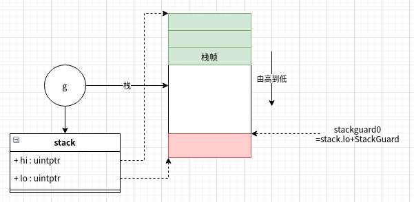

# 动态栈

## 栈布局



### 初始栈大小

```text
stacksize = round2(_StackSystem + _StackMin)

_StackMin = 2048
_StackSystem = sys.GoosWindows*512*sys.PtrSize + 
                sys.GoosPlan9*512 + 
                sys.GoosDarwin*sys.GoarchArm*1024 + 
                sys.GoosDarwin*sys.GoarchArm64*1024
```

默认初始大小为2KB，部分操作系统有额外的栈空间。


